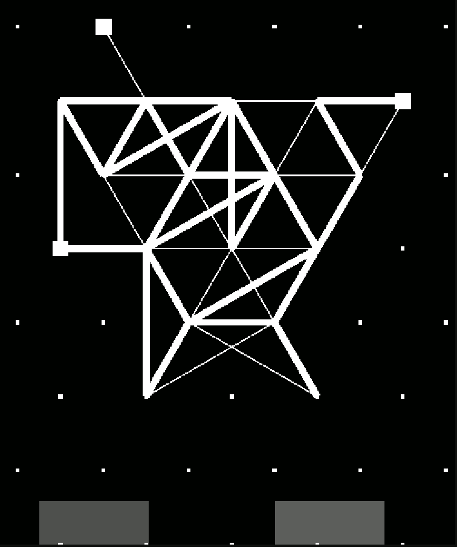
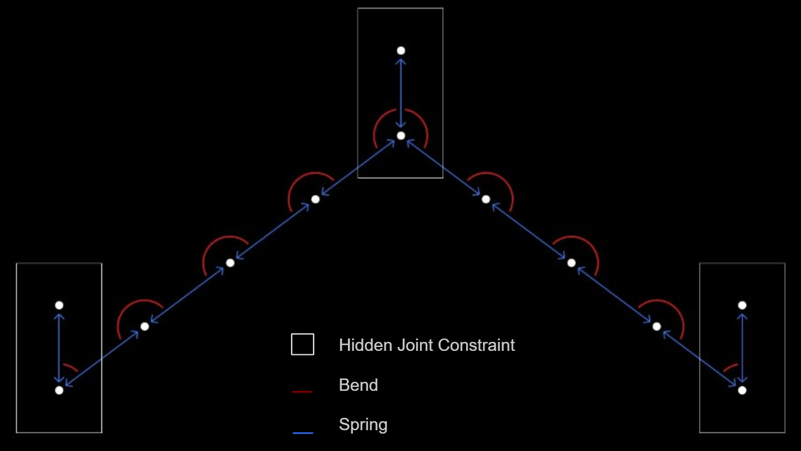
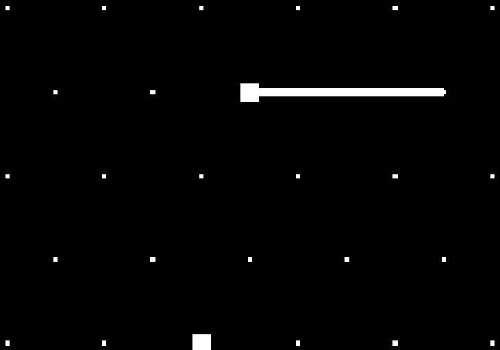
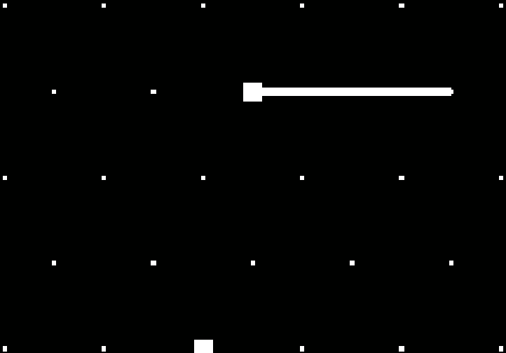
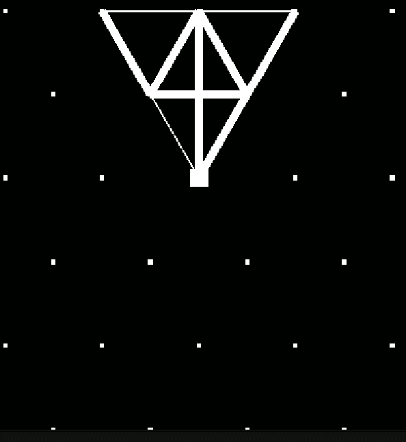
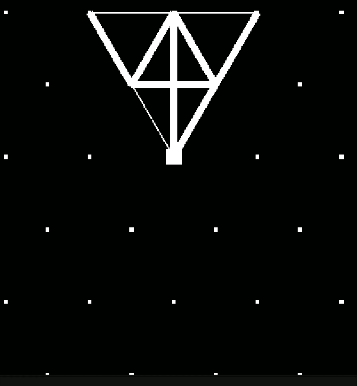
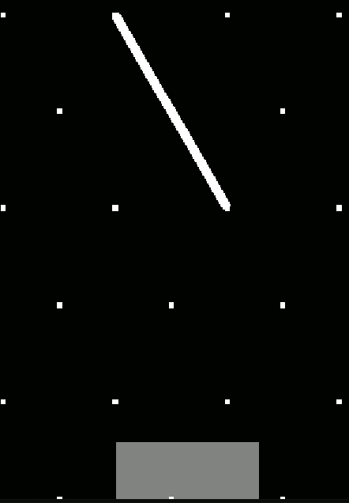
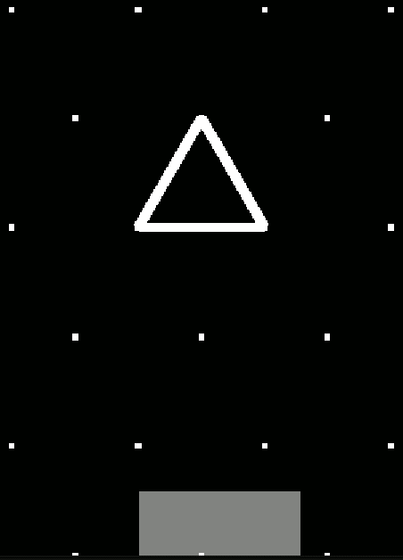
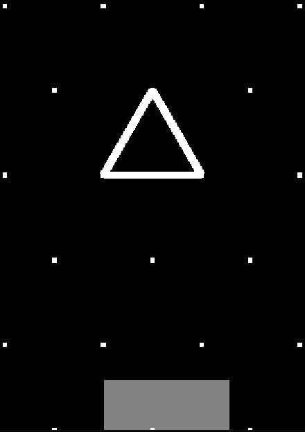

# Overview

This project is a Unity 2d softbody rod simulation program based on mass-spring system, additionally using joints, orthogonally decoupled damping, and topological tearing. By modifying the parameters, the framework can represent different material behaviors, ranging from rope-like motion to beam-like structures and hinge-based pendulum motion.

 

  
## Orthogonal Damping

In contrast to conventional mass–spring systems, which typically employ a single global damping term applied uniformly to particle velocities, the proposed method decomposes damping into multiple physically interpretable components to achieve more controlled and anisotropic energy dissipation. Specifically, damping is separated into spring-aligned damping, rotational (bending) damping, and aerodynamic drag.

Spring damping acts along the tangent direction of the beam segment, corresponding to the line-of-action velocity between connected particles, and primarily attenuates axial oscillations. Rotational damping, defined in the perpendicular direction to the beam segment, is applied to velocity components that contribute to angular motion and bending, thereby directly controlling curvature-induced oscillations. Aerodynamic drag introduces an additional global dissipation term that scales with velocity magnitude, modeling ambient resistance.

   

  

       

  

       

- The three rows, from top to bottom, illustrate rope-like, beam-like, and mixed structural behaviors. 

- The three columns, from left to right, show simulations without damping, with standard damping, and with orthogonal damping.

As a result, standard (isotropic) damping often leads to overly fast convergence or motion distortions that are less physically accurate. In contrast, orthogonal damping improves numerical stability and produces convergence behavior that more closely aligns with real physical dynamics.

## Joint

This project also extends inter-segment connectivity through a unified joint formulation, where connections between rod segments are parameterized as rigid, hinge, or partially constrained joints. The formulation introduces a hidden line element connected to all incident rods within the same bending-constraint framework. This lightweight approach avoids explicitly modeling angular motion while still producing stable and visually plausible deformation results.

A rigid joint is implemented as a high-stiffness bending constraint, strongly suppressing relative angular deformation and effectively enforcing near-zero curvature between adjacent segments. A hinge joint removes bending resistance, allowing free relative rotation while maintaining positional connectivity; this formulation naturally enables pendulum-like behavior when combined with an anchored endpoint. A partial joint introduces intermediate bending stiffness, providing controllable resistance to angular deformation and enabling smooth transitions between flexible and stiff responses.

Consequently, different material and structural behaviors can be expressed within a single unified system.

        

- The three images, from left to right, illustrate the behavior of hinge joints, partial joints, and rigid joints, respectively.

## Tearing

Another key extension of the proposed method is its support for topological tearing, whereby beam connectivity is adaptively modified under stress-based criteria, enabling segmentation of the structure during simulation. When internal forces exceed predefined thresholds, constraints and spring connections are selectively removed, resulting in fracture and the formation of independent deformable components.

     

- The two images compare the differnet behaviors of simulation without or with tearing.
  
## Collision

           

